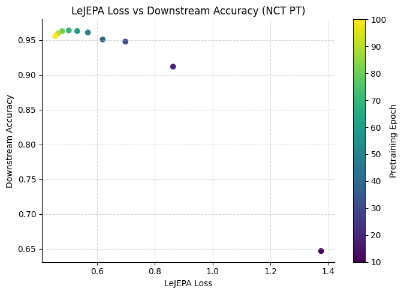

# A simple implementation of LeJEPA for histopathology

This repo is a simple reimplementation of [LeJEPA](https://github.com/rbalestr-lab/lejepa/tree/main) specifically for histopathology image analysis. 
I used standard PyTorch along with a basic trainer I created, borrowing implementation from the original codebase's [MINIMAL.md](https://github.com/rbalestr-lab/lejepa/blob/main/MINIMAL.md) file and pseudocode from the [original paper](https://arxiv.org/pdf/2511.08544).

The code is currently implemented for simple CNN architectures (ResNets), supports multicrops and DDP, and performs logging using wandb.  

## Key Requirements

- python ≥ 3.8
- torch ≥ 1.13.0
- torchvision ≥ 0.14.0
- wandb

## Using the code

Scripts are provided to show examples for pretraining and downstream supervised finetuning for a SLURM cluster environment. 
Generic arguments can be found in `utils/default_args.py` and task-specific arguments are in respective train scripts.

## Results (in progress!)

I pretrained LeJEPA on unlabelled patches taken from the [SemiCOL](https://www.semicol.org/) challenge dataset as well as the (unlabelled) train set of [NCT-CRC-HE-100K](https://zenodo.org/records/1214456) as a small in-domain comparison. 
I finetuned on [NCT-CRC-HE-100K](https://zenodo.org/records/1214456) as a downstream tissue classification task to evaluate pretrained models.
I used a batch size of 256, 2 global crops and 8 local crops, and trained for 100 epochs. It took about 46 GB of GPU memory and 3 days to train. All results are obtained by training a linear layer on top of pretrained weights with the model frozen.

### Overall comparison
I used SimCLR with similar settings as a baseline for comparison. 
I trained both a ResNet50 and ViT-Small using LeJEPA, with the ResNet50 using `lr=2e-3` and `lambda=0.05`, and ViT using `lr=5e-4` and `lambda=0.02`.
LeJEPA seemed to generalize reasonably well to both architectures with very minimal tuning, though the ViT performed worse when pretraining on the smaller dataset (could be because it is more data hungry).

| Pretraining Method | Pretraining Dataset                                              | Architecture | Cls. Acc. | Cls. F1 |
|--------------------|------------------------------------------------------------------|--------------|-----------|---------|
| LeJEPA             | Patches taken from [SemiCOL](https://www.semicol.org/) challenge | ResNet50     | 0.949     | 0.924   |
| SimCLR             | Patches taken from [SemiCOL](https://www.semicol.org/) challenge | ResNet50     | 0.931     | 0.902   |
| LeJEPA             | NCT-CRC-HE-100K                                                  | ResNet50     | **0.956**     | **0.947**   |
| LeJEPA             | Patches taken from [SemiCOL](https://www.semicol.org/) challenge | ViT-Small     | 0.946     | 0.924   |
| LeJEPA             | NCT-CRC-HE-100K                                                  | ViT-Small     | 0.927     | 0.919   |

### Pretraining progress
The following details the pretraining progress of the first and third rows in the results table above. Compared to the patch dataset from SemiCOL, the unlabelled train set of NCT-CRC-HE-100K is about 10 times smaller. 
LeJEPA seems to converge quickly in these experiments (which may be why loss and downstream accuracy are not correlated when pretraining on SemiCOL). 

| Pretrain Epoch | LeJEPA Loss (SemiCOL PT) | Acc. (SemiCOL PT)  | LeJEPA Loss (NCT PT) | Acc. (NCT PT)  | 
|----------------|--------------------------|--------------------|----------------------|----------------|
| Random Init.   | N/A                      | 0.536              | N/A                  | 0.536          |
| 10             | 0.609                    | 0.954              | 1.376                | 0.647          |
| 20             | 0.554                    | 0.951              | 0.863                | 0.912          |
| 30             | 0.537                    | 0.952              | 0.698                | 0.948          |
| 40             | 0.526                    | 0.954              | 0.619                | 0.951          |
| 50             | 0.516                    | 0.951              | 0.568                | 0.961          |
| 60             | 0.507                    | 0.947              | 0.531                | 0.963          |
| 70             | 0.497                    | 0.954              | 0.502                | 0.964          |
| 80             | 0.487                    | 0.955              | 0.479                | 0.963          |
| 90             | 0.481                    | 0.956              | 0.465                | 0.960          |
| 100            | 0.478                    | 0.949              | 0.455                | 0.956          |

LeJEPA loss seems to be reasonably well correlated against downstream accuracy for pretraining on the unlabelled NCT-CRC-HE-100K train set (plotted below):

## Acknowledgements

Big thanks to the excellent original work that this repo is based on! This is the [LeJEPA codebase](https://github.com/rbalestr-lab/lejepa/blob/main/) and the [original paper](https://arxiv.org/pdf/2511.08544).
